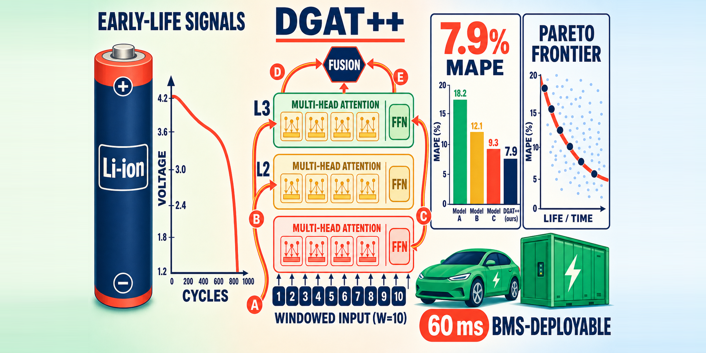

# DGAT++ & Stackelberg Game for Li-ion Battery Early-Life Prediction and Fast-Charging Protocol Optimization

> Official code for the manuscript *"Fast-charging protocol optimization and early-life
> prediction for lithium-ion batteries in EV and energy-storage systems: a joint DGAT++
> and Stackelberg-game framework"* (submitted to **Energy**, Elsevier).

[](https://www.python.org/)
[](https://pytorch.org/)
[](LICENSE)

This repository contains the full source code, experiment scripts, configs and figures
to reproduce every table and figure in the paper. It uses **only public datasets**
(MIT/Stanford/Toyota Severson 2019 and HUST) — no proprietary data is required.

<p align="center">
  
</p>

---

## Highlights

We propose DGAT++, a cross-window dense-skip graph-attention encoder that reduces the early-life-prediction MAPE from 16.46% to 7.90% under 5-fold cross-validation on the MIT Severson dataset.

For the first time, a Stackelberg game with implicit differentiation is applied to lithium-ion battery fast-charging protocol optimization, improving the Hypervolume by 15% and accelerating the solution by 20×.

Systematic synergistic ablation demonstrates that upgrading the core encoder architecture improves performance more than stacking auxiliary modules such as HSMM/HGNN on a plain backbone, and that the HGNN serves as a "stability regularizer" for in-distribution tasks.

Single-cell inference takes 12 ms (60 ms for the ensemble), far below the typical BMS control cycle (100–1000 ms), enabling direct embedded deployment in the battery-management units of electric vehicles and energy-storage systems.

## Main results (Task A: early-life prediction, MIT 5-fold CV)

| Method | Type | MAPE (%) ↓ | RMSE ↓ | p vs Severson |
|---|---|---:|---:|---|
| Severson Elastic Net (Nature Energy 2019) | classical | 16.46 | 193.4 | — |
| LSTM (Zhang 2018) | classical DL | 10.04 | 146.0 | < 0.01 |
| BatteryGPT-Lite (2025 SOTA, simplified) | causal Transformer | 11.67 | 159.8 | < 0.01 |
| PBT-Lite (2025 SOTA, simplified) | Mixture-of-Experts | 10.29 | 148.1 | < 0.001 |
| DGAT-Lite (2025 SOTA, simplified) | window graph | 8.97 | 136.6 | < 0.0001 |
| **DGAT++ (ours)** | architectural | **7.90** | **122.1** | **< 0.0001** |

DGAT++ vs DGAT-Lite: per-cell paired t-test t = −2.05, **p = 0.042**; Wilcoxon p = 0.047.

## Repository structure

```
.
├── src/battery_paper/        # core package
│   ├── data/                 # loaders: MIT/Severson (BSEBench parquet), HUST, CALCE
│   ├── features/             # Severson hand-crafted features (v1/v2)
│   ├── models/
│   │   ├── baselines/        # Severson EN, LSTM(+Attn), BatteryGPT/PBT/DGAT-Lite, Vanilla CT
│   │   └── proposed/         # DGAT++ encoder, HSMM, protocol-cell HGNN, composite model
│   ├── games/stackelberg.py  # Stackelberg game + implicit differentiation
│   └── train.py              # 5-fold KFold training loop
├── scripts/
│   ├── run/                  # all experiment / sweep / ensemble / plotting scripts
│   ├── download/             # public-dataset download helpers
│   └── setup/install.sh      # extra-dependency install
├── experiments/              # YAML configs
├── tools/                    # md→docx, packaging, verification helpers
├── docs/                     # datasets / baselines / method-design notes
├── paper/
│   ├── paper_zh.md           # manuscript source (Chinese)
│   └── figs/                 # all paper figures
├── submission/               # Energy submission package (manuscript, highlights, cover letter, graphical abstract)
├── pyproject.toml
├── requirements.txt
├── CITATION.cff
└── LICENSE
```

## Installation

```bash
git clone https://github.com/<user>/DGATplusplus-Battery.git
cd DGATplusplus-Battery

conda create -n battery python=3.10 -y && conda activate battery   # optional
pip install -e .            # installs src/battery_paper
pip install -e ".[dl]"      # + torch / torch_geometric / transformers
# or simply:
pip install -r requirements.txt
```

Reference environment: Python 3.10, PyTorch 2.2 (CUDA 12.2), trained on a single Tesla T4 (16 GB).

## Datasets (public, downloaded separately)

| Dataset | Content | Source |
|---|---|---|
| MIT/Stanford/Toyota Severson 2019 | 124 LFP cells, 72 CC-CC protocols | `data.matr.io` + HuggingFace `bsebench-org/severson-2019` |
| HUST | 77 NCA/NCM/NCM-NCA cells | Zenodo `10.5281/zenodo.6405084` |
| CALCE (optional) | CS2 / CX2 | `calce.umd.edu/data` |

```bash
bash scripts/download/mit_huggingface.sh      # MIT Severson (~600 MB)
bash scripts/download/hust.sh                 # HUST (~50 MB)
```

See `docs/01_datasets.md` for details. Raw data and trained checkpoints are **not** committed
to git (see `.gitignore`); pretrained checkpoints / result JSONs are published on the GitHub
**Releases** page (they exceed the 100 MB git limit).

## Quickstart — reproduce the main table

Using pretrained checkpoints (download the Release archives first):

```bash
# unpack pretrained checkpoints + result JSONs into the repo root
tar -xzf 01_checkpoints_main.tar.gz
tar -xzf 05_results_jsons.tar.gz
tar -xzf 07_processed_data_meta_logs.tar.gz

PYTHONPATH=src python scripts/run/ensemble_multi_seed.py --model dgat_plus
# expected: MAPE 7.90%, RMSE 122.1 cycles
```

From scratch (≈ 18 min on a single GPU):

```bash
PYTHONPATH=src python scripts/run/sweep_multi_seed.py \
    --model dgat_plus --epochs 80 --seeds 42,7,2026,1024,100,777 \
    --out_root experiments/dgat_plus
PYTHONPATH=src python scripts/run/ensemble_multi_seed.py --model dgat_plus
```

Other experiments:

```bash
# §4.2.5 DGAT++ × {HSMM, Graph, Full} synergistic ablation
PYTHONPATH=src python scripts/run/summarize_dgatp_composite.py
PYTHONPATH=src python scripts/run/ttest_dgatp_composite.py
PYTHONPATH=src python scripts/run/plot_dgatp_composite.py

# §4.4 Task B — Stackelberg protocol optimization
PYTHONPATH=src python scripts/run/task_b_charging_opt.py

# §4.5 cross-domain MIT → HUST
PYTHONPATH=src python scripts/run/eval_hust_crossdomain.py
```

## Citation

If you use this code, please cite the paper (see `CITATION.cff`). A `BibTeX` entry will be
added once the DOI is assigned.

## License

Code is released under the [MIT License](LICENSE). The manuscript and figures are licensed
under CC-BY 4.0.
